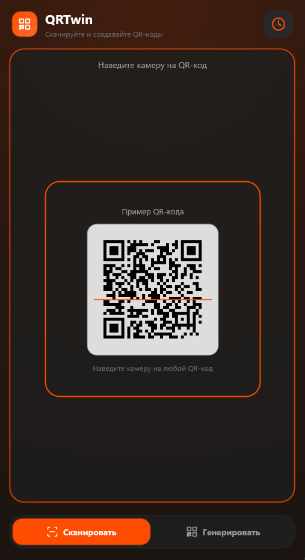
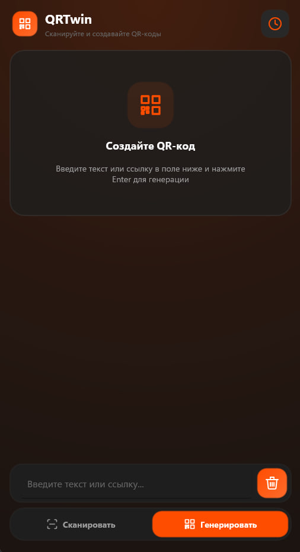
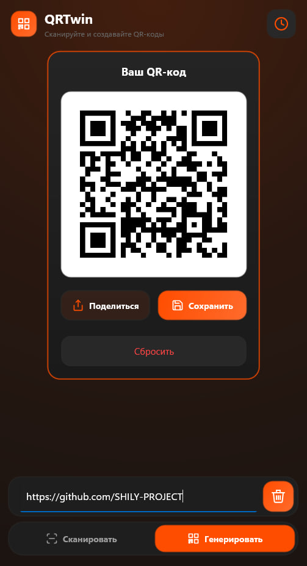
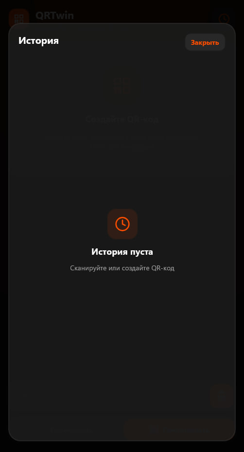
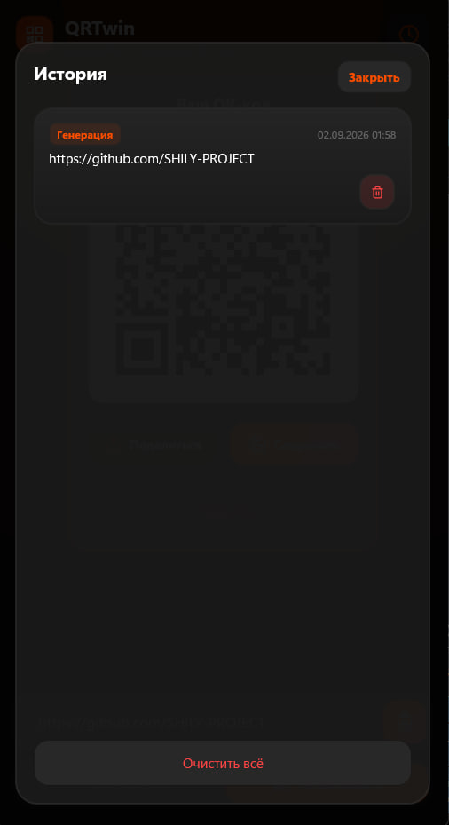

# QRTwin

**Сканируйте и создавайте QR-коды** — кросс-платформенное приложение на **.NET 10** и **.NET MAUI** для Windows и Android.

<p align="center">
  
  
  
  
</p>

---

## Скриншоты

### Основные экраны

<p align="center">
  
  &nbsp;&nbsp;
  
  &nbsp;&nbsp;
  
</p>

<p align="center">
  <sub><b>Сканирование</b> · <b>Генерация</b> · <b>Результат</b></sub>
</p>

### История

<p align="center">
  
  &nbsp;&nbsp;
  
</p>
~~~~
<p align="center">
  <sub><b>Список записей</b> · <b>Пустое состояние</b></sub>
</p>

---

## Возможности

| | |
|---|---|
| 📷 **Сканирование** | Распознавание QR через камеру (ZXing.Net.Maui), копирование и открытие ссылок |
| ✨ **Генерация** | QR из текста или URL, мгновенный предпросмотр |
| 📤 **Экспорт** | Поделиться или сохранить PNG на устройство |
| 🕘 **История** | Локальное хранение сканов и генераций в SQLite, восстановление записи в нужный экран |
| 🎨 **Интерфейс** | Тёмная тема, адаптивный макет, SVG-иконки |

---

## Технологии

- **.NET 10** · **C# 14** · **.NET MAUI 10**
- **MVVM** — CommunityToolkit.Mvvm
- **QR** — ZXing.Net.Maui
- **Графика** — SkiaSharp, Svg.Skia
- **Хранение** — sqlite-net-pcl

---

## Быстрый старт

### Требования

- [.NET 10 SDK](https://dotnet.microsoft.com/download)
- Visual Studio 2022 17.14+ или JetBrains Rider с workload **.NET Multi-platform App UI development**
- **Android:** SDK API 21+
- **Windows:** Windows 10/11 SDK

### Windows

```bash
git clone https://github.com/SHILY-PROJECT/QRTwin.git
cd QRTwin

dotnet build src/QRTwin/QRTwin.csproj -f net10.0-windows10.0.19041.0
dotnet run --project src/QRTwin/QRTwin.csproj -f net10.0-windows10.0.19041.0
```

Или откройте `QRTwin.slnx` и запустите профиль **Windows Machine**.

### Android

Подключите устройство или эмулятор:

```bash
dotnet build src/QRTwin/QRTwin.csproj -f net10.0-android
dotnet build -t:Run -f net10.0-android src/QRTwin/QRTwin.csproj
```

> При первом запуске приложение запросит доступ к камере.

### Публикация

Скрипт `build.ps1` в корне репозитория собирает релизные артефакты в папку `build/`:

```powershell
# Windows: single-file exe (self-contained)
.\build.ps1 windows

# Android: APK
.\build.ps1 android

# Обе платформы
.\build.ps1 all
```

По умолчанию используется конфигурация `Release`. Для `Debug`:

```powershell
.\build.ps1 android -Configuration Debug
```

**Результат:**

| Платформа | Путь |
|-----------|------|
| Windows | `build/windows/QRTwin.exe` |
| Android | `build/android/com.qrtwin.manager-Signed.apk` |

---

## Структура проекта

```
src/QRTwin/
├── Models/           # Модели данных
├── ViewModels/       # MVVM (CommunityToolkit.Mvvm)
├── Views/            # XAML-представления
├── Services/         # QR, SQLite, разрешения
├── Controls/         # SvgIconView и др.
├── Converters/       # XAML-конвертеры
├── Behaviors/        # Поведения UI
├── Helpers/          # Вспомогательные классы
├── Platforms/        # Windows, Android
└── Resources/        # Стили, SVG-иконки, шрифты
```

---

## Зависимости

| Пакет | Назначение |
|-------|------------|
| CommunityToolkit.Mvvm | MVVM, команды, observable-свойства |
| CommunityToolkit.Maui | FileSaver, UI toolkit |
| ZXing.Net.Maui.Controls | Сканирование и генерация QR |
| SkiaSharp.Views.Maui.Controls | SkiaSharp в MAUI |
| Svg.Skia | Отрисовка SVG-иконок |
| sqlite-net-pcl | Локальная история |

---

## Лицензия

Проект распространяется под лицензией [MIT](LICENSE).
